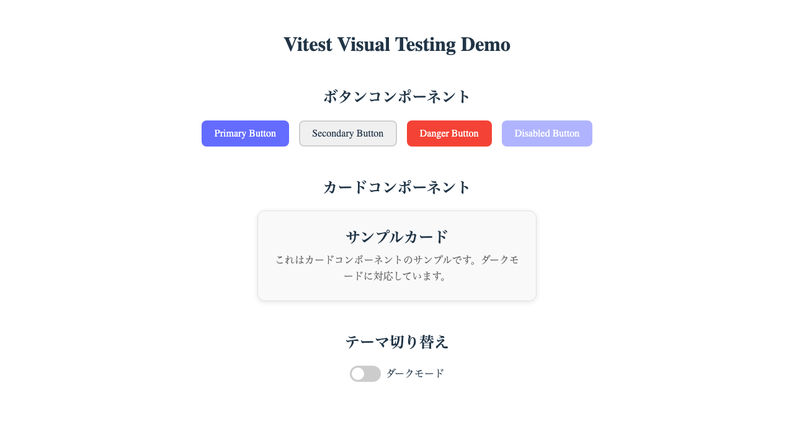
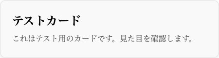

Vitest 4.0.0-beta.4で追加された`toMatchScreenshot`を使って、実際にReactコンポーネントのビジュアルテストを実装してみました。本記事では、実際のコードとスクリーンショットを交えながら、Vitestでのビジュアルテストの実践方法を紹介します。

## はじめに

今回作成したデモプロジェクトでは、Button、Card、Toggleといった基本的なUIコンポーネントのビジュアルテストを実装しました。



## 環境構築

### package.json

```json
{
  "name": "vitest-visual-testing-demo",
  "scripts": {
    "test": "vitest",
    "test:ui": "vitest --ui",
    "test:browser": "vitest --browser"
  },
  "devDependencies": {
    "@vitest/browser": "4.0.0-beta.4",
    "@vitest/ui": "4.0.0-beta.4",
    "vitest": "4.0.0-beta.4",
    "playwright": "^1.49.1",
    "@testing-library/react": "^16.1.0"
  }
}
```

### vitest.config.ts

```typescript
import { defineConfig } from 'vitest/config'
import react from '@vitejs/plugin-react'

export default defineConfig({
  plugins: [react()],
  test: {
    browser: {
      enabled: true,
      name: 'chromium',
      provider: 'playwright',
      headless: true,
      viewport: {
        width: 1280,
        height: 720
      },
    },
    environment: 'happy-dom',
    globals: true,
    setupFiles: './src/__tests__/setup.ts',
  },
})
```

重要なポイント：

- `browser.enabled: true`でブラウザモードを有効化
- `provider: 'playwright'`でPlaywrightを使用
- `viewport`で画面サイズを固定（スクリーンショットの一貫性のため）

## なぜProviderが必要なのか？

Vitest Browser Modeには3つのプロバイダがあります：

### 1. Default (Preview Provider)
- **ローカル開発専用**：既存のブラウザを再利用して動作
- **制限**：ヘッドレスモード非対応、CI環境で動作しない
- **イベント処理**：実際のDOMイベントではなくシミュレーション

### 2. Playwright Provider (推奨)
- **CI対応**：ヘッドレスモードでCI環境での実行が可能
- **高性能**：Chrome DevTools Protocolを使用、並列実行対応
- **真のブラウザ自動化**：実際のブラウザイベントを発火

### 3. WebDriverIO Provider
- **幅広いブラウザサポート**：モバイルテスト（Appium）にも対応
- **既存プロジェクト**：WebDriverIOを既に使用している場合に最適

**つまり、本格的なビジュアルテストには`provider`の指定が必須です。**特にCIでの自動テストやスクリーンショット比較では、Playwrightが最も適しています。

## 実践例1: Buttonコンポーネントのテスト

### テストコード

```typescript
import { test, expect } from 'vitest'
import { render } from '@testing-library/react'
import Button from '../components/Button'

test('Buttonコンポーネントのバリエーション', async () => {
  // Primary button
  const { container: primaryContainer } = render(
    <Button variant="primary">Primary Button</Button>
  )
  await expect(primaryContainer.firstChild).toMatchScreenshot('button-primary.png')
  
  // Secondary button
  const { container: secondaryContainer } = render(
    <Button variant="secondary">Secondary Button</Button>
  )
  await expect(secondaryContainer.firstChild).toMatchScreenshot('button-secondary.png')
  
  // Danger button
  const { container: dangerContainer } = render(
    <Button variant="danger">Danger Button</Button>
  )
  await expect(dangerContainer.firstChild).toMatchScreenshot('button-danger.png')
  
  // Disabled button
  const { container: disabledContainer } = render(
    <Button disabled>Disabled Button</Button>
  )
  await expect(disabledContainer.firstChild).toMatchScreenshot('button-disabled.png')
})
```

### 実際のスクリーンショット


このように、各ボタンバリアントのスクリーンショットが自動で保存され、次回実行時には比較が行われます。

### Hover状態のテスト

```typescript
test('ボタンのhover状態', async () => {
  const { container } = render(
    <Button variant="primary">Hover Button</Button>
  )
  const button = container.firstChild as HTMLElement
  
  // 通常状態
  await expect(button).toMatchScreenshot('button-normal-state.png')
  
  // hover状態をシミュレート
  button.classList.add('hover')
  await expect(button).toMatchScreenshot('button-hover-state.png')
})
```


hover状態も`classList.add('hover')`でシミュレートして検証できます。

## 実践例2: Cardコンポーネントのテスト

### 基本的なカードテスト

```typescript
test('カードコンポーネントの見た目', async () => {
  const { container } = render(
    <Card 
      title="テストカード"
      description="これはテスト用のカードです。見た目を確認します。"
    />
  )
  
  await expect(container.firstChild).toMatchScreenshot('card-default.png')
})
```



### ダークモード対応のテスト

```typescript
test('ダークモードでのカード', async () => {
  // ダークモード用のコンテナを作成
  const darkContainer = document.createElement('div')
  darkContainer.className = 'dark'
  document.body.appendChild(darkContainer)
  
  const { container } = render(
    <Card 
      title="ダークモードカード"
      description="ダークモードでの見た目を確認します。"
    />,
    { container: darkContainer }
  )
  
  await expect(container.querySelector('.card')).toMatchScreenshot('card-dark.png')
  
  // クリーンアップ
  document.body.removeChild(darkContainer)
})
```

ダークモードのテストでは、親要素に`dark`クラスを付けてコンテキストを作成しています。

## 実践例3: Toggleコンポーネントのテスト

```typescript
test('トグルコンポーネントの状態', async () => {
  // OFF状態
  const { container: offContainer } = render(
    <Toggle checked={false} onChange={() => {}} label="テストトグル" />
  )
  await expect(offContainer.firstChild).toMatchScreenshot('toggle-off.png')
  
  // ON状態
  const { container: onContainer } = render(
    <Toggle checked={true} onChange={() => {}} label="テストトグル" />
  )
  await expect(onContainer.firstChild).toMatchScreenshot('toggle-on.png')
})
```


トグルのON/OFF状態もそれぞれスクリーンショットで検証できます。

## アプリケーション全体のテスト

複数のコンポーネントが組み合わさった状態もテストできます：

```typescript
test('アプリケーション全体のスクリーンショット', async () => {
  const { container } = render(<App />)
  
  // アプリ全体のスクリーンショット
  await expect(container.firstChild).toMatchScreenshot('app-light-mode.png')
})

test('複数コンポーネントの組み合わせ', async () => {
  const { container } = render(<App />)
  
  // ボタングループセクション
  const buttonSection = container.querySelector('.section:nth-child(2)')
  await expect(buttonSection).toMatchScreenshot('button-group-section.png')
  
  // カードセクション
  const cardSection = container.querySelector('.section:nth-child(3)')
  await expect(cardSection).toMatchScreenshot('card-section.png')
})
```

## スクリーンショットの管理

スクリーンショットは以下のような構造で保存されます：

```text
src/__tests__/__screenshots__/
├── App.test.tsx/
│   ├── app-light-mode-chromium-darwin.png
│   ├── button-group-section-chromium-darwin.png
│   └── card-section-chromium-darwin.png
├── Button.test.tsx/
│   ├── button-primary-chromium-darwin.png
│   ├── button-secondary-chromium-darwin.png
│   └── button-hover-state-chromium-darwin.png
└── Card.test.tsx/
    ├── card-default-chromium-darwin.png
    └── card-dark-chromium-darwin.png
```

ファイル名には`{指定した名前}-{ブラウザ}-{OS}.png`の形式で自動的に環境情報が付加されます。

## 実行コマンド

```bash
# 通常のテスト実行
npm test

# UIモードで実行（ブラウザで結果を確認）
npm run test:ui

# ブラウザモードで実行
npm run test:browser
```

## 初回実行時の動作

初めてテストを実行すると、基準となるスクリーンショットが作成されます：

1. `toMatchScreenshot`が実行される
2. 基準画像がまだない場合、新規作成される
3. テストは失敗する（これは正常な動作）
4. 生成された画像を確認し、問題なければ再度テストを実行
5. 2回目以降は比較が行われる

## トラブルシューティング

### 環境による差異

異なるOS間でのフォントレンダリングの差異に注意：

- macOS: `*-chromium-darwin.png`
- Linux: `*-chromium-linux.png`
- Windows: `*-chromium-win32.png`

環境ごとに別々のスクリーンショットが生成されるため、CIとローカル環境で異なるOSを使用しても問題ありません。

### スクリーンショットの更新

デザイン変更後は基準画像を更新：

```bash
# すべてのスクリーンショットを更新
npx vitest --browser --update-snapshots
```

## CI/CDでの利用

GitHub Actionsでの設定例：

```yaml
- name: Install Playwright browsers
  run: npx playwright install chromium

- name: Run Visual Tests
  run: npm run test:browser -- --run

- name: Upload Failed Screenshots
  if: failure()
  uses: actions/upload-artifact@v3
  with:
    name: visual-test-failures
    path: src/__tests__/__screenshots__/
```

## まとめ

Vitest 4.0の`toMatchScreenshot`により、以下が実現できました：

1. **シンプルなセットアップ**：既存のVitestプロジェクトに数行の設定追加で導入可能
2. **React Testing Libraryとの統合**：既存のテストフレームワークとシームレスに連携
3. **柔軟なテスト記述**：コンポーネント単位からアプリ全体まで様々な粒度でテスト
4. **環境差異の自動管理**：OS/ブラウザごとに自動的にスクリーンショットを分離

ベータ版ではありますが、コンポーネントレベルのビジュアルテストには十分実用的です。PlaywrightやStorybookを導入するまでもない小〜中規模プロジェクトには特におすすめです。

ただし、E2Eレベルの複雑なインタラクションや、より高度なビジュアルテスト（アニメーション、レスポンシブデザイン等）が必要な場合は、専用のツールを検討することも重要です。